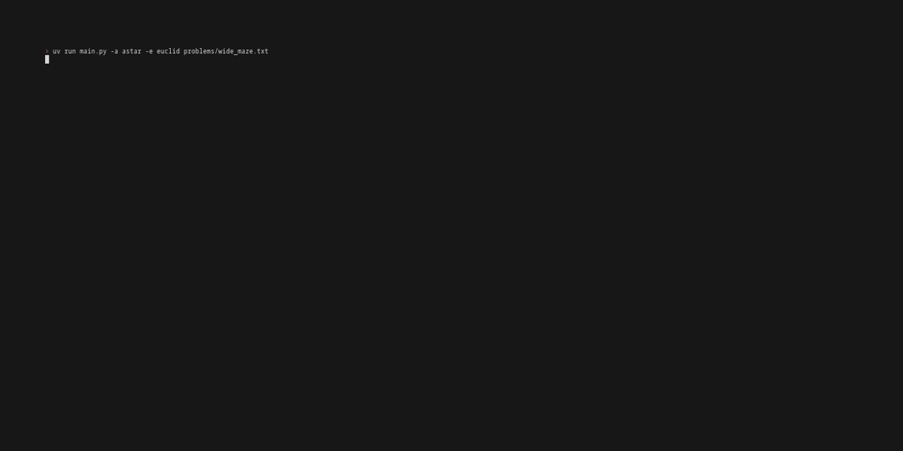

## Overview

**Grid Pathfinding Visualizer** is a CLI utility for running and comparing state-space search algorithms on 2D grids. It processes `.txt` problem instances and outputs a step-by-step visualization of the search process and the final path.

## Demo



## Requirements

- python 3.14
- [uv](https://docs.astral.sh/uv/getting-started/installation/)

## Visual Experience

For the best visual experience, run this project in a dedicated terminal emulator (like Windows Terminal, iTerm2 or Alacritty) rather than the VS Code integrated terminal or legacy CMD. Modern terminals handle animations much more smoothly, preventing flickering and alignment issues.

## How to run & Usage

1. Clone the repository.

```bash
git clone https://github.com/mdutka5/grid-pathfinding-visualizer-cli.git
cd grid-pathfinding-visualizer-cli
```

1. Run the app via uv.

```text
Command Syntax:
 uv run main.py [SEARCH OPTIONS] [DISPLAY OPTIONS] [PATH TO PROBLEM]

Example:
 uv run main.py -a astar -e euclid problems/grid.txt
 
Search Options:
    -a, --algorithm      {bfs, dfs, bibfs, gbefs, astar}
    -e, --heuristic      {man, euclid, diag}
    -w, --weight         FLOAT (Default: 0 - no diagonal movement,
          non-zero - diagonal movement allowed)

Display Options:
    -nv, --no-visual     Disable animation
    -s, --speed          FLOAT (Default: 8)
    -c, --concise        Show summary in condensed way

Path to problem instance:
    -problems are stored in problems/ directory.
```

## Adding your own problem

You can design your own problems by adding a `.txt` file to the `problems/` directory. The visualizer parses the grid using the following rules:

- **`S`** : Start Node
- **`G`** : Goal Node
- **`#`** : Wall (Impassable)
- **` `** : Free Space (Walkable)

### Example (`my_maze.txt`)

```text
##########
#S       #
#  ####  #
#     #  #
#  #### G#
##########
```

## Algorithm & Heuristic Details

### Search Algorithms (`-a`)

- `bfs` (Breadth-First Search): Guaranteed shortest path. Radiates outward equally in all directions. Checks every possible node until it hits the target.
- `dfs` (Depth-First Search): Find any path quickly. Dives into one direction. Often results in long, non-optimal paths that.
- `bibfs` (Bi-directional BFS): Faster shortest path. Starts two searches, one at start, one at goal. They meet in the middle, usually exploring significantly fewer nodes than a standard BFS.
- `gbefs` (Greedy Best-First): High-speed discovery. Only cares about the distance to the goal. It’s fast but doesn't guarantee optimal solution.
- `astar` (A*): Guaranteed shortest path. Balances the distance already traveled with the estimated distance remaining. Most efficient way to find the absolute shortest path.

### Heuristics (`-e`)

Heuristics estimate the distance to the goal. Used in A* and Greedy Best-First.

- `man` (Manhattan): Calculates distance by summing the absolute differences of the coordinates
- `euclid` (Euclidean): Calculates the straight-line distance using the Pythagorean theorem
- `diag` (Diagonal): Calculates the shortest path on a grid where diagonal steps are allowed
